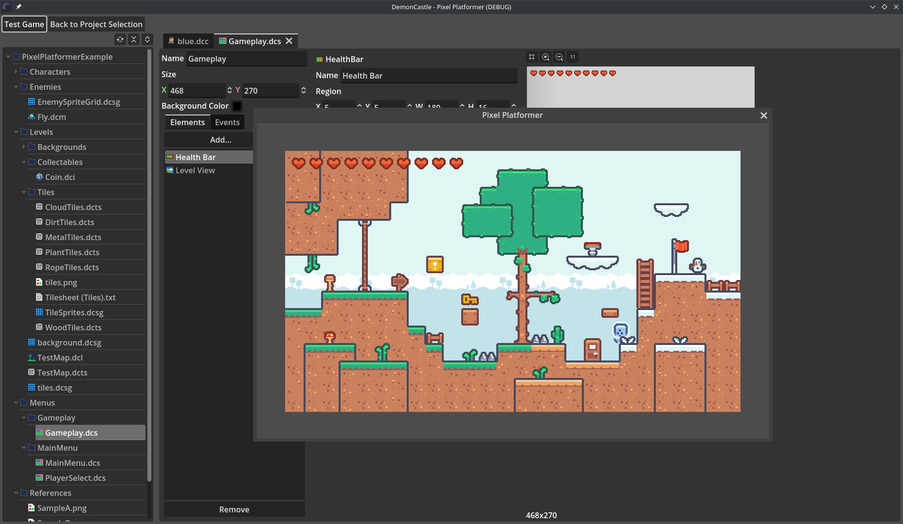

# Chapter 1 - Foreword

Demon Castle transcends singular formity; That is to say: it makes itself. It is both the creator and the creation. The paint brush and the canvas. The Commander and the Legion.

With Demon Castle, anyone can make entire worlds for others to discover and explore. With Demon Castle, anyone can play the role of the Hero: mighty, brave, curious, wise... malefactor... sycophant...

# Chapter 2 - How to Build Demon Castle

Demon Castle is built using an artefact known as [Godot](https://godotengine.org/). Godot is the basis of Demon Castle. As such, their essense is the same; it is both the editor and the player. The Godot editor is created using Godot.

To go on a brief tangent: Godot is written in the languge C++, which must be compiled. Those compilers are written in C++, which are compiled by themselves. "It is turtles, all the way down..."

I appologize... back on track: To build Demon Castle, one must merely follow these steps, in the order presented:

1. Acquire and install the .NET version of `4.2.1-stable`. It can be found [here](https://godotengine.org/download/archive/4.2.1-stable/).

2. Clone (or Download) this Demon Castle repository.

3. Open Godot, and Import the Demon Castle repository.

4. Open the "DemonCastle" project in Godot, and click "Run Project (F5)" in the top right. This will build and launch Demon Castle.

